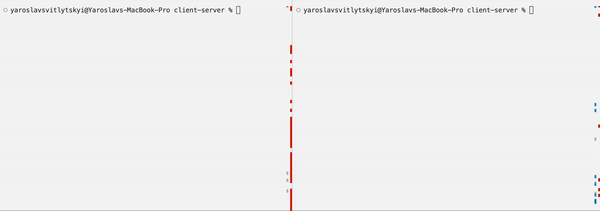

# client-server-fifo

[](https://github.com/vshymanskyy/StandWithUkraine/blob/main/docs/README.md)

## General Information

Client-Server application based on FIFO IPC approach in C++.

## Use case

The project compilation should be done with the help of **Make GNU**

In order to start execution, run the following command:
```bash
make build
./main
```

Below you can see example of program execution.

